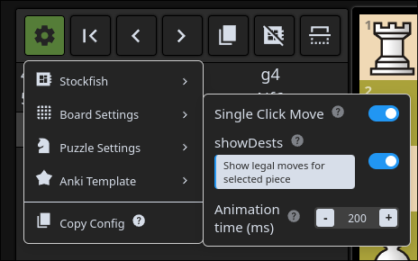

# Anki Chess Note Template

#### Features:

- Works on desktop and ankidroid/anki mobile
- Robust PGN functionality, including multi line support, and embedded shapes. 
- Local stockfish analysis for back side.
- Built in configuration menu to design cards of many types.
  - Puzzle mode: Solve a tactic defined by a PGN.
  - Study mode: Play both sides of a given PGN.
  - play FEN position vs AI.
- A [Companion Addon](https://ankiweb.net/shared/info/1300975327) to streamline updating and managing configurations


> [give a tip!](https://ko-fi.com/towelsniffer1437).

# installation

download the apkg in [releases](https://github.com/TowelSniffer/Anki-Chess-2.0/releases) and import to anki. 

## Updating 

Can be handled automatically via the [Companion Addon](https://ankiweb.net/shared/info/1300975327). Otherwise watch for new releases if you want to manage this yourself. 


## Help

Refer to configuration tool tips or 'About' menu for information on config options, and helpful information for using the ankiChess note template. 



> Join the [discord](https://discord.gg/YPj4Pz2Qzw).

# Table of Contents

- [Companion Addon](src/assets/docs/_CompanionAddon.md)
- [Board Modes](src/assets/docs/_BoardModes.md)
- [Config Options](src/assets/docs/_ConfigOptions.md)
- [Recent Changelog](src/assets/docs/_ChangeLog.md)

# Build

```bash
npm install
npm run build
```

## build ankiChess note template (apkg file/media files)

[uv](https://docs.astral.sh/uv/getting-started/installation/) is required for building the apkg file

```bash
uv venv
uv pip install genanki
```

Then run:
```bash
npm run build:anki
```

Build media only (no uv requirement)
```bash
npm run build:anki-media
```


files generated in 'dist-anki'

