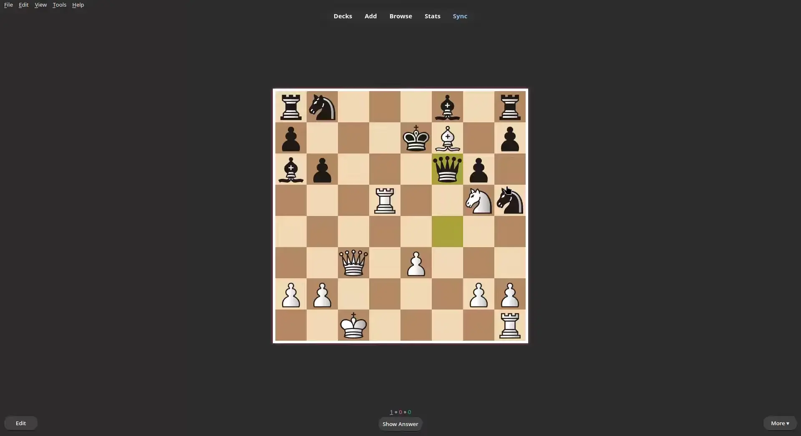

# Anki-Chess-2.0
An interactive chess template for anki. 




## Getting started

How to install:

1. Go to the **[_Releases_ page](https://github.com/TowelSniffer/Anki-Chess-2.0/releases)**.
1. In the latest release's _Assets_ section, download "chess.apkg".
1. Open Anki and make sure your devices are all synchronised.
1. In the _File_ menu, select _Import_.
1. Browse for and select the downloaded file `chess.apkg`.
1. Download the Media Files.rar folder and extract. Copy the contents of the Media Files folder into you anki collection.media folder

👉 To stay informed of new releases, make sure to [watch this repository's releases](https://help.github.com/en/articles/watching-and-unwatching-releases-for-a-repository).

## Customization

### First Move Orientation

For both of the following lines changing `flip=true` to `flip=false`. should result in the first move of the PGN being the first move in the puzzle, as oppose to the default behaviour which is that the first moves plays automatically and you must then respond.

On the front side:

```
	document.getElementById("Board").src = `_chess3.0.html?PGN=` + PGN + `&flip=true&backgroundColor=` + backgroundColor + `&handicap=` + handicap + ``;
```

and on the backside ate the bottom: 

```
	document.getElementById("analysisBoard").src = `_ChessTempoViewer.html?PGN=` + PGN + `&flip=true&errorCheck=` + errorCheck + `&backgroundColor=` + backgroundColor + ``;
```

### Handicap

Changing the value of handicap in the following line will decide in the number of wrong moves you can make before the answer is shown. Note: Amount of wrong moves is equal to the value of handicap + 1.

```
	var handicap = 0;
```

## Cross Compatability

I have verified compatability with Windows/Linux and Ankidroid, however cannot verify for IOS and MAC. This is a note template however, and does not rely on addons, so it should be compatable. 

## Upgrading

The upgrade process is typically the same as the installation process explained in the [previous section](#getting-started). However, some situations require extra care. As a general rule, **always read the release notes carefully**; they will likely tell you what to do or point you to a page that does.

## Sharing your own decks

You are welcome to share your own premade decks for others to use. to do this export your deck as CrownAnki json representaion and uncheck the include media option. media will have to be included in a seperate zip file and imported manually. see the shared lichess study for an example. 


## resources used For this were:

#### ~~ChessBoard js~~
~~https://chessboardjs.com/index.html~~

#### Chessground
https://github.com/ornicar/chessground

#### and the PGN viewer
https://github.com/mliebelt/PgnViewerJS

#### Auerswald Collection, 3500 tactics (PGN format)
http://gorgonian.weebly.com/pgn.html

#### chess.js
https://github.com/jhlywa/chess.js/blob/master/README.md

#### pgn-parser (much better than what I tried to write haha)
https://github.com/mliebelt/pgn-parser


#### ultimate geography for the plagiarized readme
https://github.com/anki-geo/ultimate-geography
