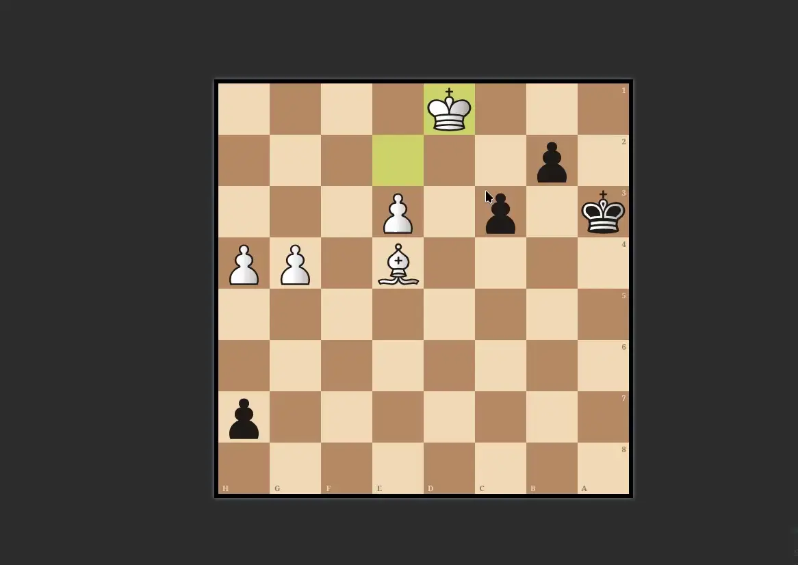
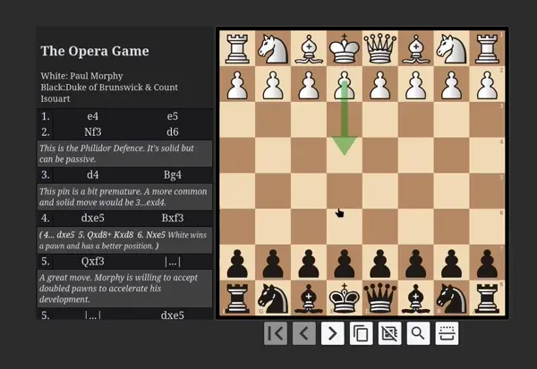

# Anki-Chess-2.0
An interactive chess template for anki.

## practice tactics

## Study Games

## Features

- Works with PGN format
- All the amenities, such as promotions, sound effects etc.
- Stockfish engine (This is a weaker version running as pure js).
- Board auto orientates dpending on first move of given puzzle.
- Works offline and on Ankidroid (Ankidroid verified, IOS).
- No addons required (The companion addon is just to make the installation process easy).
- Analysis board on the backside.
- Border indicates mistakes, puzzle completion, and player colour.
- support for multiple lines. this means you can choose multiple moves to be the correct answer, and the cards will respond with a random move (if multiple lines exist).

👉 To stay informed of new releases, make sure to [watch this repository's releases](https://help.github.com/en/articles/watching-and-unwatching-releases-for-a-repository). Also [Discord server](
https://discord.gg/YPj4Pz2Qzw). 

## Getting started

### How to install/update

[See here](documentation/installation.md)

### Customization

[See here](documentation/userConfig.md)

## Compatability Issue

[See here](documentation/compatability.md)

## Apps that use this:

- [AnkifyPGN](https://github.com/ThoughtfulSenpai/AnkifyPGN): A GUI to batch create flashcards. Now also an anki addon: [
addon](https://ankiweb.net/shared/info/569467423)
- Share your own?

## With thanks to...

#### Chessground <3
https://github.com/ornicar/chessground

#### chess.js
https://github.com/jhlywa/chess.js/blob/master/README.md

#### pgn-parser
https://github.com/mliebelt/pgn-parser

#### ~~ChessBoard js~~
~~https://chessboardjs.com/index.html~~

#### ~~PGN viewer~~
~~https://github.com/mliebelt/PgnViewerJS~~
