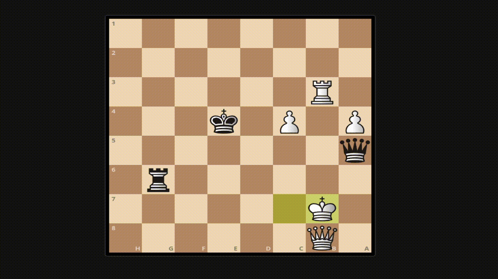
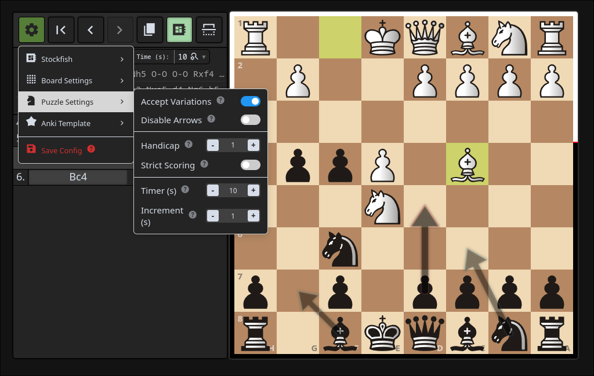
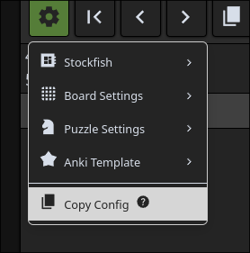
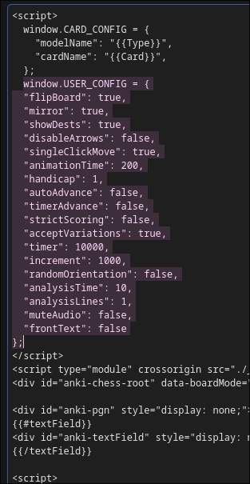

# Anki Chess Note Template

#### Features:

- Works on desktop and ankidroid/anki mobile
- Robust PGN functionality, including multi line support, and embedded shapes. 
- Local stockfish analysis for back side.



# installation

download the apkg in [releases](https://github.com/TowelSniffer/Anki-Chess-2.0/releases) and ioimport to anki

### [Companion Addon](https://github.com/TowelSniffer/ankiChess-Companion-Addon?tab=readme-ov-file)

This is not required for the templates but will provide additional functionality:
- Check for updates weekly, and handle updating for you existing templates
-- NOTE: will attempt to update any template with PGN as first field
- Provides an API to allow more utility from template. 
- Allows saving config option to template automatically

### Configuring the templates

#### Auto update settings for current template with companion addon (Also works with anki connect)



## No addon

Without this addon, the card settings will need to be applied manually to BOTH sides via the copy to clipboard option.



> replace this part:



# Build

```bash
npm install
npm run build
```

## build ankiChess note template (apkg file/media files)

[uv](https://docs.astral.sh/uv/getting-started/installation/) is required for building the apkg file

```bash
uv venv
uv pip install genanki
```

Then run:
```bash
npm run build:anki
```

Build media only (no uv requirement)
```bash
npm run build:anki-media
```


files generated in 'dist-anki'

