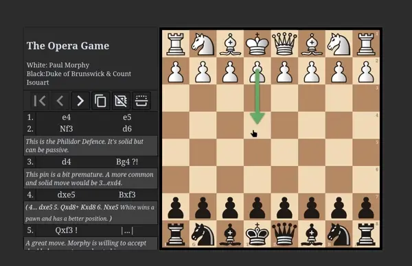

# Anki-Chess-2.0

An interactive chess template for anki.

## practice tactics

## Study Games

## Features

- Works with PGN format
- All the amenities, such as promotions, sound effects etc.
- Stockfish engine (This is a weaker version running as pure js).
- Board auto orientates dpending on first move of given puzzle.
- Works offline and on Ankidroid (Ankidroid verified, IOS).
- No addons required (The companion addon is just to make the installation process easy).
- Analysis board on the backside.
- Border indicates mistakes, puzzle completion, and player colour.
- support for multiple lines. this means you can choose multiple moves to be the correct answer, and the cards will respond with a random move (if multiple lines exist).

👉 To stay informed of new releases, make sure to [watch this repository's releases](https://help.github.com/en/articles/watching-and-unwatching-releases-for-a-repository). Also [Discord server](https://discord.gg/YPj4Pz2Qzw). [Support <3](https://ko-fi.com/towelsniffer1437)

## Getting started

### [How to install/update](documentation/installation.md)

### [Card Creation](documentation/cardCreation.md)

### [Customization](documentation/userConfig.md)

### [Compatability Issues](documentation/compatability.md)

[walktrough Video](https://youtu.be/UpNYGrnCmEE?si=QHdeiV7oE8pgA6pC)

## Shared decks

[Joins the community on discord](https://discord.gg/hEhzRH7pMG)

## Apps that use this:

- [AnkifyPGN](https://github.com/ThoughtfulSenpai/AnkifyPGN): A GUI to batch create flashcards. Now also an anki addon: [
  addon](https://ankiweb.net/shared/info/569467423)
- [Chessli2](https://github.com/pwenker/chessli2/tree/main): A tool that can import tactics and msitakes from your Lichess games
- Share your own?

## With thanks to...

#### Chessground <3

https://github.com/ornicar/chessground

#### chess.js

https://github.com/jhlywa/chess.js/blob/master/README.md

#### pgn-parser

https://github.com/mliebelt/pgn-parser

#### ~~ChessBoard js~~

~~https://chessboardjs.com/index.html~~

#### ~~PGN viewer~~

~~https://github.com/mliebelt/PgnViewerJS~~
